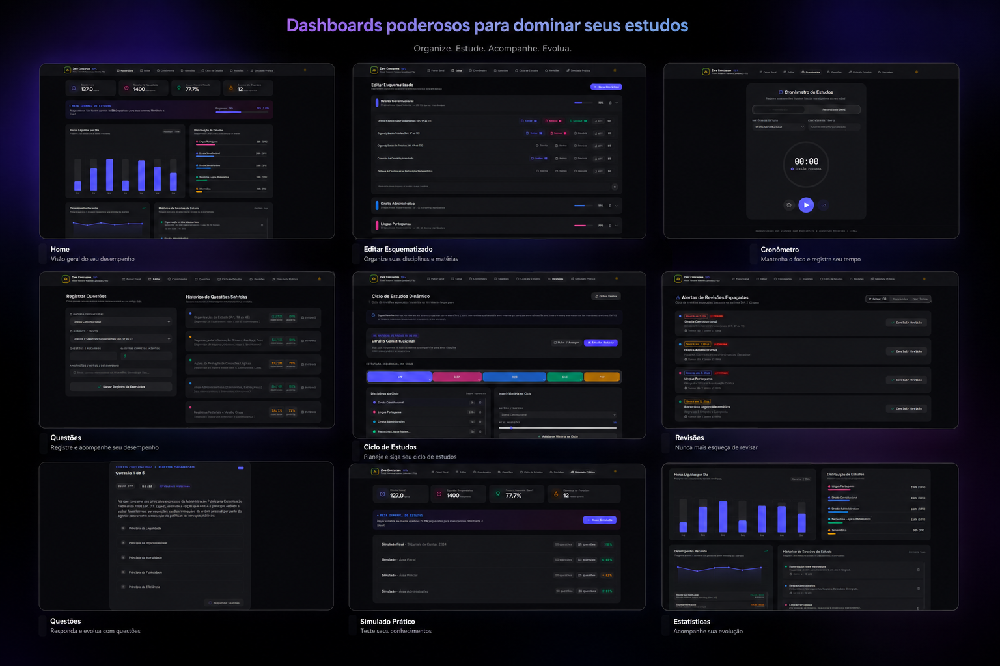

# Concurseiro Pro — Plataforma de Estudos para Concursos Públicos



Plataforma completa para gestão de estudos para concursos públicos. Organize seu edital, cronometre sessões de estudo, acompanhe questões resolvidas, gerencie ciclos de estudo, agende revisões e faça simulados — tudo com estatísticas em tempo real.

## Funcionalidades

- **📊 Painel Geral** — Visão geral do desempenho: horas de estudo, aproveitamento em questões, meta semanal e gráfico de barras dos últimos 7 dias
- **📋 Edital** — Gerencie matérias e tópicos com checklist de progresso (teoria estudada, resumo criado, revisão feita)
- **⏱️ Cronômetro** — Cronometre seus estudos por matéria com notas e salvamento automático no histórico
- **📝 Questões** — Registre questões resolvidas por tópico com controle de acertos/erros e histórico detalhado
- **🔄 Ciclo de Estudos** — Monte um ciclo personalizado de matérias (ex: A → B → C → A) sem dias fixos, evitando acúmulo
- **🔔 Revisões** — Revisões agendadas automaticamente 24h após cada sessão de estudo
- **🎯 Simulado Rápido** — Simulado interativo com 5 questões estilo concurso, correção comentada e envio da pontuação ao painel

## Requisitos

- [Node.js](https://nodejs.org/) (v18+)
- Navegador moderno (Chrome, Firefox, Edge)

## Como rodar localmente

```bash
# 1. Instalar dependências
npm install

# 2. (Opcional) Configurar chave da API Gemini
#    Crie um arquivo .env na raiz com:
#    GEMINI_API_KEY="sua-chave-aqui"
#    APP_URL="http://localhost:3000"

# 3. Iniciar servidor de desenvolvimento
npm run dev
```

O app será aberto em http://localhost:3000.

## Chave da API Gemini — para que serve?

O `@google/genai` está nas dependências para **funcionalidades futuras** com IA:
- **Geração de questões** personalizadas para o simulado
- **Explicações detalhadas** dos gabaritos com fundamentação jurídica
- **Sugestões de estudo** adaptativas baseadas no seu desempenho
- **Recomendação de revisões** prioritárias

> ⚠️ **Atualmente o app funciona 100% com dados mock (exemplo).** A chave Gemini é opcional por enquanto — quando as features de IA forem implementadas, o app usará a chave automaticamente.

> A chave pode ser obtida gratuitamente em [Google AI Studio](https://aistudio.google.com/apikey).

## Tecnologias

- **React 19** + **TypeScript**
- **Vite 6** para build e dev server
- **Tailwind CSS 4** para estilização
- **Lucide React** para ícones
- **Tailwind Motion** para animações
- **Google Gen AI** (preparado para IA)

## Licença

Este projeto é de uso pessoal/educacional.
